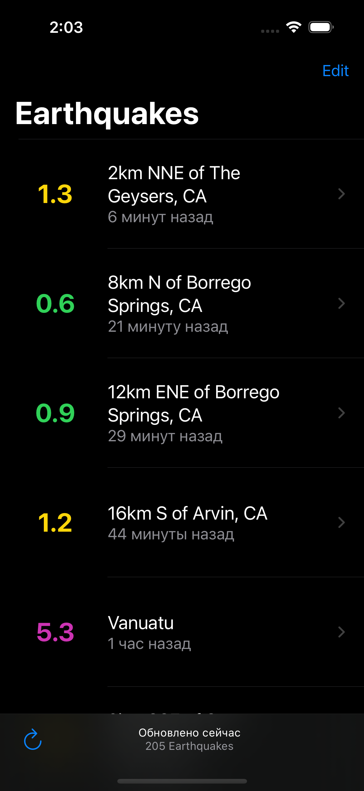
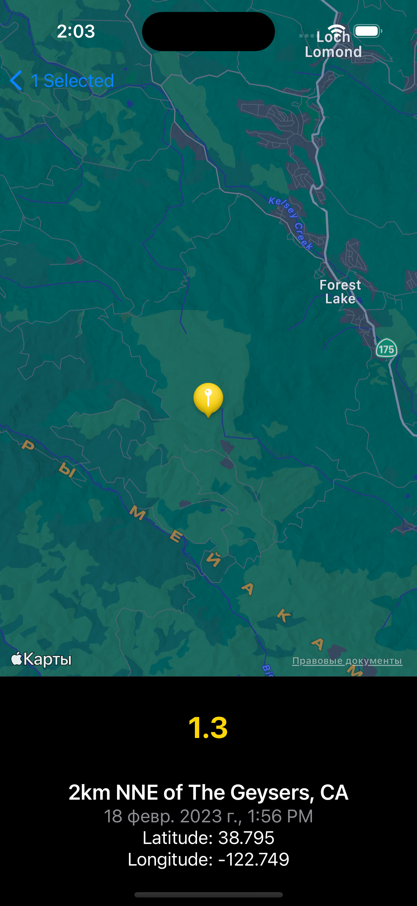

# Earthquakes

The app shows a list of recent earthquakes across the world and the detail screen with a map of each quake

    
    

## Tests

I've used TestPlan to run tests with different configurations

App has

* Unit tests
* UI tests
